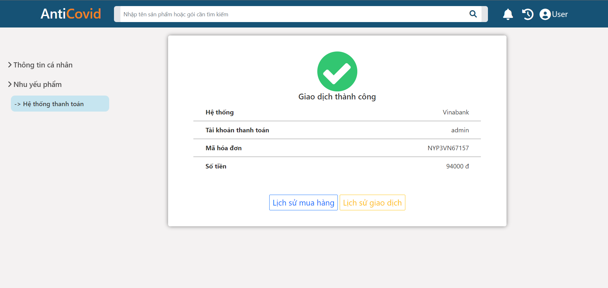

# AntiCovid
AntiCovid is a management system for people who are suspected or infected with Covid-19. The system includes 3 actors: admin, manager, patient.
[VinaBank](https://github.com/9alaty-coL/VinaBank) is a banking system built to pay for bills of patients managed by AntiCovid
***
## Members:

1. Trần Quốc Đông - 19120479
2. Lê Minh Hậu - 19120502
3. Trần Tấn Lộc - 19120564
4. Nguyễn Hoàng Nam - 19120595
## Technologies
    
     

## Deployment 
[AntiCovid](https://anticovid19.herokuapp.com/)

## Core Features
* Manage people related to Covid-19
* Manage treatment
* Support, provide essential packages
* Connect with VinaBank for payment
* Statistics, charts

## Screenshot
Patient

    
    

Manager

    
    

Admin

    
    

## Run

In the project directory, you can run:
## `npm install`
## `npm start`

Runs the app in the development mode.\
Open [http://localhost:3000](http://localhost:3000) to view it in your browser.
##### NodeJS is required.
